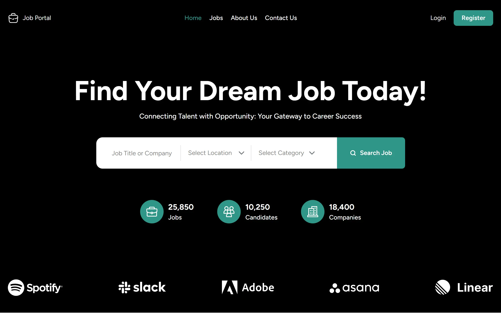
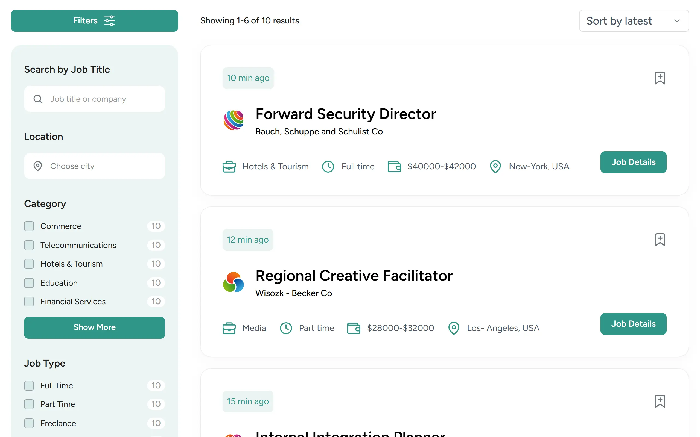

# 💼 Job Portal – 求人サイト

## 🔗 デプロイURL

https://t-nakanishi-dev.com/works/html-css/figma/jobportal/

## 📸 スクリーンショット

### 🏠 Home

### 💼 Jobs

## 📝 アプリ概要

Figmaのデザインをもとに制作した、求人情報を探すためのWebサイトです。

Home、Jobs、Job Details、About Us、Contact Usの5ページを制作し、PC・スマートフォンの両方に対応したレスポンシブデザインを実装しています。

求人カードやカテゴリ、企業情報、FAQ、お問い合わせフォームなど、求人サイトで使用されるUIを複数ページにわたって構築しました。

## 🔧 使用技術

* HTML5
* CSS3
* JavaScript
* Figma

### CSS設計

CSSは役割ごとにファイルを分割して管理しています。

* `reset.css`：デフォルトスタイルのリセット
* `base.css`：サイト全体の基本スタイル
* `components.css`：ボタン・バッジ・求人カードなどの共通コンポーネント
* `layout.css`：ヘッダー・フッターなどのレイアウト
* `style.css`：各ページの詳細なスタイリング

## ✨ 主な機能・実装

### 🏠 Home

* 求人検索
* 求人数・候補者数・企業数の統計表示
* 求人一覧
* 求人カテゴリ一覧
* 企業ロゴ表示
* Aboutセクション
* Testimonials
* Blogセクション

### 💼 Jobs

* 求人一覧表示
* 求人検索
* カテゴリ・雇用形態・経験レベルなどの絞り込み
* 給与レンジ
* タグ表示
* 並び替え
* ページネーション
* Top Company一覧

### 📄 Job Details

* 求人詳細情報
* Job Overview
* 求人タグ
* 求人シェア
* 関連求人
* Google Maps埋め込み
* お問い合わせフォーム

### ℹ️ About Us

* Aboutページ紹介
* サービス利用の流れ
* Videoセクション
* FAQ
* サービスの特徴紹介
* Blogセクション

### 📩 Contact Us

* 会社情報表示
* お問い合わせフォーム
* Google Maps埋め込み
* 企業ロゴ表示

### 📱 レスポンシブ対応

768pxをブレークポイントとして、PC・スマートフォンそれぞれのレイアウトを調整しています。

* モバイル用ハンバーガーメニュー
* ナビゲーションの開閉
* オーバーレイ表示
* 求人カードの縦型レイアウト
* グリッドレイアウトの1カラム化
* お問い合わせフォームの1カラム化
* フッターのモバイルレイアウトへの切り替え
* 各ページの文字サイズ・余白の調整

### 🎨 Figmaデザインの再現

Figmaのデザインをもとに、各ページのレイアウト・余白・文字サイズ・カラー・カードデザインなどをHTML/CSSで再現しました。

### 🧩 CSSの役割分担

CSSを複数のファイルに分割し、リセット・基本設定・共通コンポーネント・レイアウト・ページ固有のスタイルを整理しました。

特に求人カードなど、複数のページで使用するUIは共通クラスとして設計しています。

### 📱 レスポンシブ対応

PCだけでなくスマートフォンでも閲覧しやすいように、768pxをブレークポイントとしてレイアウトを切り替えています。

デスクトップでは複数カラムで表示しているコンテンツを、モバイルでは1カラムに変更するなど、画面幅に応じて調整しました。

### 🍔 ハンバーガーメニュー

JavaScriptを使用して、スマートフォン用のハンバーガーメニューを実装しました。

* メニューの開閉
* オーバーレイ表示
* メニュー表示中の背景スクロール防止
* メニュー内リンククリック時の自動クローズ
* `aria-expanded` による開閉状態の管理

を実装しています。

### 🎛️ UIパーツのカスタマイズ

標準のフォームUIをそのまま使用するのではなく、チェックボックスやセレクトボックス、給与レンジなどをCSSでカスタマイズし、デザインに合わせました。

また、求人カードや企業カードなどにはホバー時のアニメーションを設定しています。

### 📐 Flexbox・Gridの活用

FlexboxとCSS Gridを使い分け、カード一覧・2カラムレイアウト・4カラムレイアウトなど、ページごとに適したレイアウトを構築しました。

## 📌 今後の実装候補

現在はフロントエンドのUI制作を中心としているため、以下の機能は今後の実装候補としています。

* FAQの開閉機能
* お問い合わせフォームの送信処理
* ログイン・会員登録機能

## 👤 作者情報

**t-nakanishi-dev**

Portfolio: https://t-nakanishi-dev.com/

GitHub: https://github.com/t-nakanishi-dev

